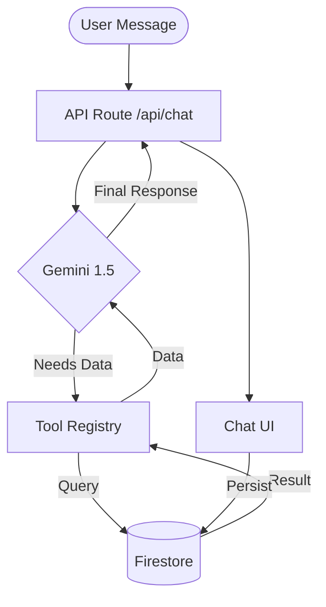

# Waddi Chat: Unified Agent Architecture

## The Problem
The legacy chat logic was built on **Client-Side Brittle Rules**.
- Hardcoded keyword matching (`lower.includes("budget")`).
- Static responses from a massive JSON object (`MARKET_DATA`).
- No real-time database querying or execution safety.
- Impossible to scale or maintain as new capabilities are added.

## The Solution: Waddi Core (The Brain)
Waddi is transitioning to a **Server-Side Agentic Architecture** that uses an LLM as a reasoning engine to coordinate specialized "Action Blocks".

### 1. The Request Lifecycle
1.  **Ingress**: User Sends message -> Chat API.
2.  **Reasoning**: LLM (Gemini) determines **Intents** and **Tool Requirements**.
3.  **Tool Execution**: The server executes deterministic code (Search, DB Query, Booking Trigger).
4.  **Synthesis**: LLM takes tool results + conversation history to generate a natural response.
5.  **State Sync**: The results are returned to the client and persisted in Firestore.

---

### 2. Core Components

#### A. The Agent Loop (Server-Side)
Moves the logic from `page.tsx` to `app/api/chat/route.ts`.
- **System Prompt**: Defines Waddi’s persona and available toolset.
- **Function Calling**: Replaces `extractIntent`. Gemini chooses the right function (e.g., `get_vendors`, `build_budget`).

#### B. The Tool Registry
A library of server-side functions that interact with the database and external APIs.
- `search_vendors(city, category, guest_count)`
- `retrieve_inventory(event_type)`
- `calculate_budget(event_id)`
- `send_vendor_brief(vendor_id, message)`

#### C. Deterministic Workflow Blocks
For complex multi-step processes (e.g., "Booking a Vendor"), we use a **State Machine** pattern to ensure safety.
- **Node: Prerequisite Check**: Does the user have a selected city/event? If not, pause agent and request info.
- **Node: Validation**: Is the budget realistic for the requested city?
- **Node: Execution**: Fire the Firebase trigger.

---

### 3. Data Flow

### 4. Why This Scales
- **Decoupled Logic**: Adding a new feature (e.g., "AI Scheduling") just means adding a new function to the **Tool Registry** and describing it in the **System Prompt**.
- **Server-Side Safety**: Critical tasks like "Confirm Booking" are handled by server code with proper auth and validation, not client-side scripts.
- **Context Awareness**: The Agent can query *real* data instead of relying on mocked constants.

---

## Direct Implementation Map
- `app/api/event-ai/route.ts` -> Becomes `app/api/chat/route.ts` (The reasoning engine).
- `lib/tools/` -> New directory for Action Blocks (The executor).
- `app/dashboard/hosts/chat/[id]/page.tsx` -> Simplified to a pure UI component (The view).
